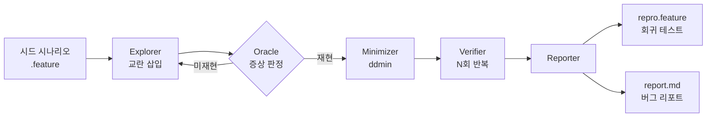

# 🔍 Retrace

> 증상만 알려진 간헐 결함의 **최소 재현 스텝을 자동으로 찾아내는** 웹 QA 도구
> 찾아낸 재현 스텝은 그대로 실행 가능한 BDD 회귀 테스트가 됩니다


---

## 왜 만들었나

"가끔 결제 금액이 이상하게 찍힌다" 같은 제보는 재현 스텝이 없으면 개발팀에 넘기기 어렵습니다.
QA 엔지니어가 뒤로가기·연타·느린 네트워크 같은 조건을 하나씩 바꿔가며 재현을 시도하는 시간은 길고 반복적입니다.

Retrace는 이 과정을 자동화합니다.

1. 이슈 직전까지 아는 대략적 스텝(시드 시나리오)을 입력
2. 스텝 사이에 교란 액션을 끼워 넣으며 증상 재현 탐색
3. 재현된 시퀀스에서 불필요 스텝을 제거해 최소 재현 스텝 도출
4. 반복 실행으로 재현율 측정 + UI·API 교차 검증으로 원인 계층 분류

---

## 핵심 기능

| 기능 | 설명 |
|---|---|
| 교란 탐색 | 연타 / 뒤로가기 / 새로고침 / 네트워크 지연 / 창 크기 / 경계값 입력 |
| 다중 오라클 | 화면 검증 + 콘솔 에러 + HTTP 상태 + API 데이터 대조 |
| 최소화 | Delta Debugging(ddmin) 알고리즘으로 재현 스텝 축소 |
| 재현율 측정 | N회 반복 실행 → `확정` / `간헐` / `희귀` 등급 |
| 원인 계층 분류 | 화면 값과 API 값 대조로 FE / BE 결함 자동 구분 |
| BDD 출력 | 최소 재현 스텝을 `.feature`로 출력 → pytest-bdd 회귀 테스트로 즉시 실행 |
| 리포트 | Jira 형식 버그 리포트 + 스텝별 스크린샷 + 로그 |

---

## 동작 흐름



---

## 예시

**입력 : 시드 시나리오**

```gherkin
@oracle-api
Feature: 골드 회원 쿠폰 결제
  증상: 골드 회원 결제 금액이 가끔 너무 낮게 찍힘

  Background:
    Given "골드" 등급 회원으로 로그인하면

  Scenario: 쿠폰 적용 후 결제
    When "상품-1"을 장바구니에 담으면
    And "10% 쿠폰"을 적용하면
    And "결제" 버튼을 누르면
    Then 결제 금액은 "27000"원이다
```

**출력 : 최소 재현 시나리오**

```gherkin
Scenario: [간헐 ○○%] 쿠폰 재적용 시 할인 이중 적용
  When "상품-1"을 장바구니에 담으면
  And "10% 쿠폰"을 적용하면
  And 브라우저 뒤로가기를 하면
  And "10% 쿠폰"을 적용하면
  And "결제" 버튼을 누르면
  Then 결제 금액은 "27000"원이다
```


---

## 검증 결과

데모 쇼핑몰에 심어둔 결함 4종 기준

| 결함 | 시드 스텝 → 최소 스텝 | 첫 재현까지 시도 | 재현율 | 원인 계층 |
|---|---|---|---|---|
| 결제 연타 중복 주문 | 측정 후 기입 | 측정 후 기입 | 측정 후 기입 | BE |
| 쿠폰 할인 이중 적용 | 측정 후 기입 | 측정 후 기입 | 측정 후 기입 | BE |
| 저속 네트워크 빈 화면 | 측정 후 기입 | 측정 후 기입 | 측정 후 기입 | FE |
| 장바구니 수량 불일치 | 측정 후 기입 | 측정 후 기입 | 측정 후 기입 | FE |

버그를 끈 상태(`BUG_MODE=off`)에서는 생성된 회귀 테스트 전부 통과 확인

---

## 기술 스택

| 영역 | 스택 |
|---|---|
| 엔진 | Python / Selenium 4 / gherkin-official |
| 테스트 | pytest / pytest-bdd |
| API 검증 | requests |
| 서버 | FastAPI / WebSocket |
| 프론트엔드 | Electron |
| 빌드 | PyInstaller / electron-builder |

---

## 설치 및 실행

### 릴리스 버전
[Releases](https://github.com/Woogie-Gim/retrace/releases)에서 설치 파일 다운로드 후 실행
Chrome 브라우저 설치 필요 (드라이버는 첫 실행 시 자동 확보)

### 개발 환경

```bash
git clone https://github.com/Woogie-Gim/retrace.git
cd retrace

# 엔진
python -m venv engine/.venv
source engine/.venv/Scripts/activate
pip install -r engine/requirements.txt
cp .env.example .env

# 데모 쇼핑몰
python -m demo_shop            # http://localhost:5100

# 엔진 서버
python -m retrace.server  # http://localhost:5200

# 앱
cd app && npm install && npm run dev
```

### 회귀 테스트만 실행

```bash
pytest engine/tests/regression
```

---

## 프로젝트 구조

```
retrace/
├── engine/retrace/   # 탐색 엔진
│   ├── driver/            # Driver 인터페이스 (플랫폼 확장 지점)
│   ├── explorer/          # 교란 탐색
│   ├── oracle/            # 증상 판정
│   ├── minimizer/         # ddmin
│   ├── verifier/          # 재현율 측정
│   └── reporter/          # 리포트 생성
├── demo-shop/             # 결함을 심어둔 시연용 쇼핑몰
├── features/              # 시드 / 생성 시나리오
├── app/                   # Electron 대시보드
└── docs/                  # 개발 계획서
```

---

## 설계 포인트

- **재현 스텝 = 회귀 테스트** : 탐색 결과를 사람이 읽는 BDD 문장으로 출력해 리포트와 테스트 코드를 하나로 통합
- **화면 너머 데이터 검증** : UI에서 재현된 결함을 API 레벨에서 다시 대조해 FE 표시 오류와 BE 데이터 오류를 구분
- **간헐 결함 대응** : 후보마다 반복 실행해 1회라도 재현되면 유지하는 방식으로 탐색·최소화 진행
- **플랫폼 확장 구조** : 조작 계층을 `Driver` 인터페이스로 분리해 탐색·최소화·검증 로직 재사용 가능

---

## 향후 계획

- [ ] 모바일 게임 확장 : ADB 입력 + VLM 화면 판정 기반 `GameDriver`
- [ ] 게임 전용 교란 : 화면 전환 중 연타 / 백그라운드 전환 / 네트워크 단절
- [ ] CI 연동 : 생성 시나리오 자동 회귀 실행

---

## Author

[@Woogie-Gim](https://github.com/Woogie-Gim)
